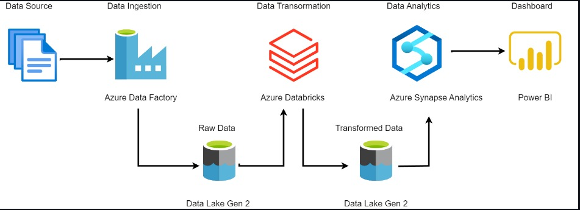

# Azure Dataflow Pipeline

This repository contains the code and resources for building and managing data pipelines in Azure using Azure Data Factory, Azure Data Lake, and other Azure Data Engineering services. The pipeline is designed to automate data ingestion, transformation, and loading (ETL) processes across multiple data sources.




## Features

- **Data Ingestion:** Automated data ingestion from a variety of sources including on-premises databases, cloud services, APIs, and file storage.
- **Data Transformation:** Leverage Azure Data Factory (ADF) for data transformations using mapping data flows and custom activities.
- **Data Storage:** Store raw and processed data in Azure Data Lake Storage Gen2 for scalable and secure storage.
- **Data Integration:** Integrate data into Azure Synapse Analytics, Azure SQL Database, or other data stores for analytics and reporting.
- **Scheduling & Monitoring:** Pipelines can be scheduled to run at regular intervals and monitored through Azure Monitor and built-in ADF reporting.

## Prerequisites 

Before setting up the pipeline, ensure you have the following:

- **Azure Subscription:** You'll need an active Azure subscription to use Azure Data Factory, Data Lake, and other resources.
- **Azure CLI or PowerShell:** These tools will help with resource provisioning and deployment.
- **Access to Data Sources:** Credentials and permissions to access data from your on-premises or cloud-based sources.

## Architecture 

The high-level architecture of the Azure Dataflow Pipeline includes:

1. **Azure Data Factory (ADF):** Orchestrates the entire ETL process, connects to data sources, and manages data flows.
2. **Azure Data Lake Storage Gen2:** Stores raw data and serves as a staging area for transformations.
3. **Data Flow Activities:** Perform data transformations such as aggregations, joins, and filtering in ADF.
4. **Azure Synapse Analytics:** The target for processed data for further analytics and reporting.

## Getting Started

### 1. Clone the Repository

```bash
git clone https://github.com/yourusername/azure-dataflow-pipeline.git
